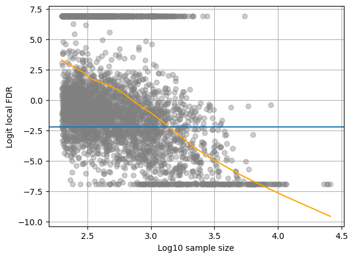
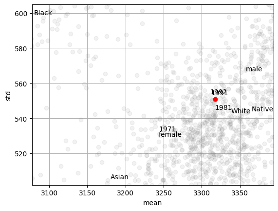
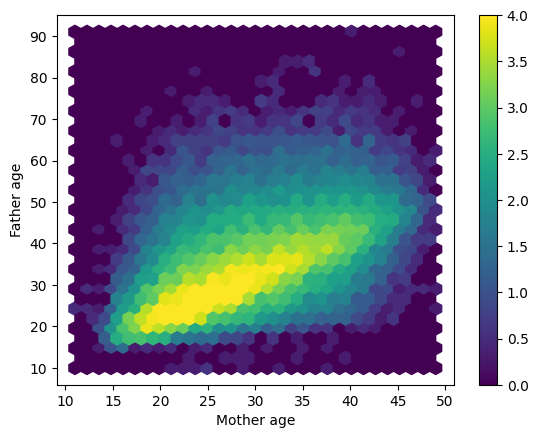

# Understanding Birth Weight Variation in U.S. Birth Records

This repository presents an end to end statistical analysis of historical U.S. natality records from the National Center for Health Statistics (NCHS). The project studies how birth weight varies at both the **individual level** and the **subpopulation level**, with particular attention to demographic structure, nonlinear age effects, and heterogeneity across county-year-sex-race strata.

## Why this project matters

Birth weight is a clinically meaningful early-life outcome that is tied to infant risk, maternal health, and broader population disparities. A single pooled model can describe average trends, but it can also hide meaningful variation across locations and demographic groups. This project therefore combines two complementary perspectives:

- **Individual-level modeling** to study how birth weight changes with predictors such as infant sex, maternal age, paternal age, plurality, and birth order.
- **Subpopulation-level heterogeneity analysis** to examine how average outcomes and effect patterns vary across geography, time, sex, and maternal race.

That combination makes the project more than a standard regression exercise. It is designed to show both statistical depth and practical interpretation.

## Project highlights

- Built a reproducible preprocessing pipeline for historical fixed-width natality records
- Analyzed both individual outcomes and aggregated subgroup summaries
- Modeled nonlinear effects for maternal and paternal age
- Used Gamma GLM and GEE style thinking for positively skewed birth weight outcomes
- Quantified cross-stratum heterogeneity using summary statistics, z-score style calibration, and FDR-oriented screening
- Paired code, report, and figures in one public-facing repository

## Data

The analysis uses historical U.S. birth records released by the NCHS. Raw natality files were harmonized into analysis-ready tables using the preprocessing code in `scripts/prep.py`.

Key variables include:

- birth weight
- infant sex
- maternal age
- paternal age
- plurality
- birth order
- state and county identifiers
- year
- maternal race

## Methods

### 1. Individual-level analysis

The individual-level workflow focuses on explaining birth weight as a quantitative outcome.

Main components:
- missingness exploration and complete-case analysis
- nonlinear age modeling
- Gamma GLM and clustered inference ideas
- interpretation of how demographic and parental characteristics relate to birth weight

### 2. Subpopulation heterogeneity analysis

The second part of the project studies variability across county-year-sex-race strata.

Main components:
- construction of subgroup summaries
- empirical variability analysis
- standardized scores to identify unusual strata
- false discovery style screening
- heterogeneity summaries motivated by ICC-like reasoning

## Selected figures

### Distribution of subgroup sample sizes

This figure shows how uneven subgroup sizes are across county-year-sex-race strata, which is important for interpreting standard errors and subgroup stability.


### Subgroup heterogeneity and stratum-specific deviations

The following figures highlight the project's second major theme: pooled summaries can miss meaningful variation across subpopulations.

<p float="left">
  
  
</p>

### Relationship structure across subgroup summaries

These plots help visualize how subgroup-level summaries relate to one another and where especially unusual or high-leverage strata may appear.

<p float="left">
  
  
</p>

### ICC-style heterogeneity summary

This figure summarizes the scale of between-subgroup variability, reinforcing that birth weight patterns are not fully captured by a single national average trend.


## Main takeaways

- Birth weight variation is not driven by a single predictor
- Maternal and paternal characteristics matter, but their effects are not purely linear
- Substantial heterogeneity remains across demographic and geographic strata
- Aggregated subgroup analysis reveals structure that would be easy to miss in a single pooled model

## Repository structure

```text
birthweight_repo_package/
├── analysis/
│   ├── birthweight.ipynb
│   ├── birthweight.Rmd
│   ├── birthweight_meta.ipynb
│   └── birthweight_meta.Rmd
├── docs/
│   └── report.pdf
├── figures/
│   ├── Distribution of subgroup sample sizes.png
│   ├── FDR.png
│   ├── Hexbin.png
│   ├── ICC line.png
│   ├── scatter.png
│   └── stratum-specific Z-scores.png
├── scripts/
│   ├── prep.py
│   └── agg.py
├── data/
├── .gitignore
└── requirements.txt
```

## Reproducibility

### Python setup

```bash
python -m venv .venv
source .venv/bin/activate
pip install -r requirements.txt
```

### Download and preprocess raw natality files

```bash
python scripts/prep.py
```

This downloads and harmonizes selected NCHS natality files into the `data/` directory.

### Build aggregated subgroup summaries

```bash
python scripts/agg.py
```

### Run the analysis

Use either the notebooks or the R Markdown files in `analysis/` depending on your preferred workflow.

## Notes

- The original project was created in a course setting and has been reorganized into a cleaner portfolio-style repository.
- The notebooks, report, and figures are included together so readers can trace the full workflow from preprocessing to interpretation.
- Large raw data files are intentionally not committed.

## Possible next improvements

- refactor notebooks into modular analysis scripts
- add an environment file for both Python and R dependencies
- include a lightweight synthetic sample for fast demonstration
- export a polished summary notebook or HTML report for non-technical readers

## Author

**Hao-Chun Shih**
